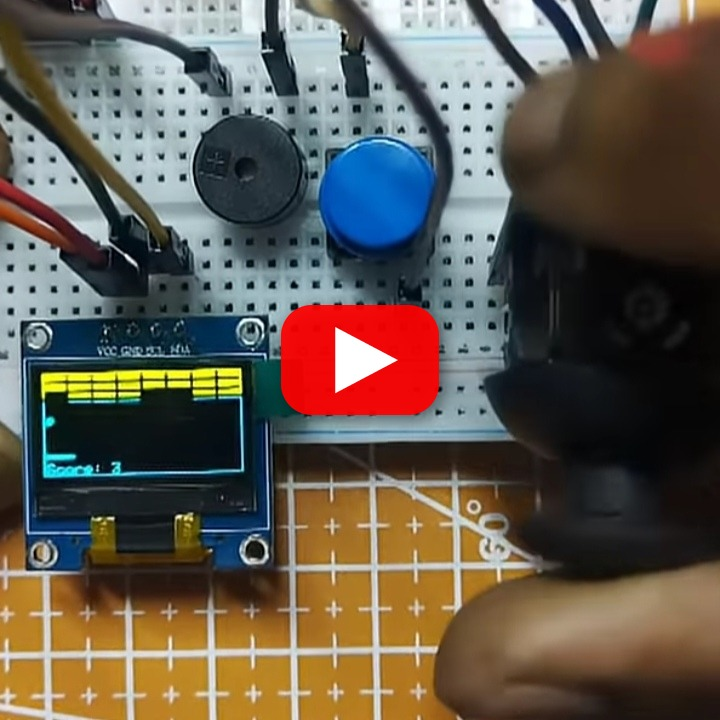
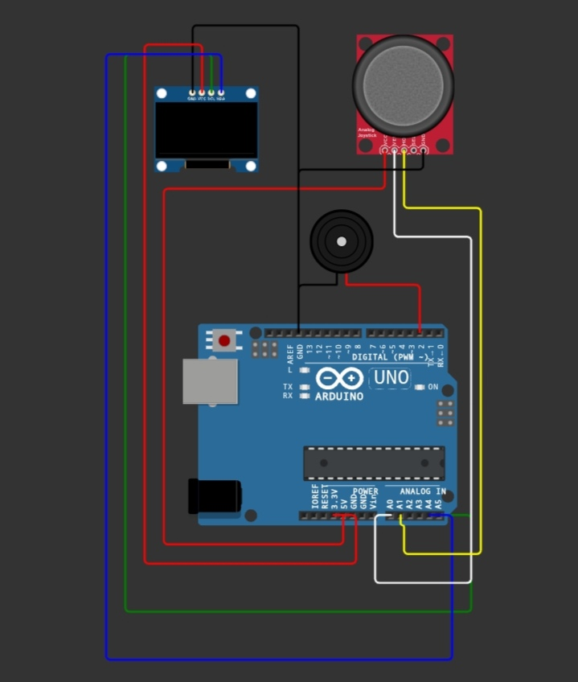

# Block Breaker on Arduino

A classic block-breaking game for Arduino with an SSD1306 OLED, joystick paddle controls, collision detection, and score tracking.

## Hardware

- Arduino-compatible board
- SSD1306 128x64 I2C OLED
- Analog joystick module
- Optional buzzer, if enabled by the sketch

## Wiring

Connect the OLED to the board's I2C SDA/SCL pins. Connect the joystick X and Y outputs to the analog inputs used in `Source-code`; connect power and ground to the corresponding board pins.

## Source

Open [`Source-code`](./Source-code) in the Arduino IDE, install the required display libraries, select the board and port, and upload.
