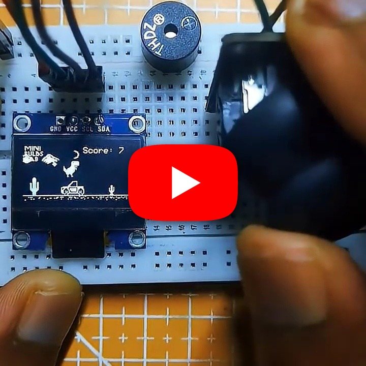

# Dino Run Game

A dinosaur-themed endless runner for Arduino/ESP32 with an SSD1306 OLED, joystick controls, obstacle avoidance, collision detection, scoring, and sound effects.

## Demo

https://youtube.com/shorts/9tusvMqC588?si=9XAGFWza56ogSxFT

## Hardware

- Arduino or ESP32
- 128x64 SSD1306 OLED
- Two-axis analog joystick
- Buzzer

## Controls

| Action | Input |
|---|---|
| Move left | Joystick X < 400 |
| Move right | Joystick X > 600 |
| Jump | Joystick Y > 600 |
| Start | Move joystick left or right |

## Wiring

| Component | Pin |
|---|---|
| OLED SDA | A4 or board SDA |
| OLED SCL | A5 or board SCL |
| Joystick X | A0 |
| Joystick Y | A1 |
| Buzzer | 3 |

## Source

Open the source sketch in this directory, install Adafruit GFX and Adafruit SSD1306, select your board and port, and upload.
