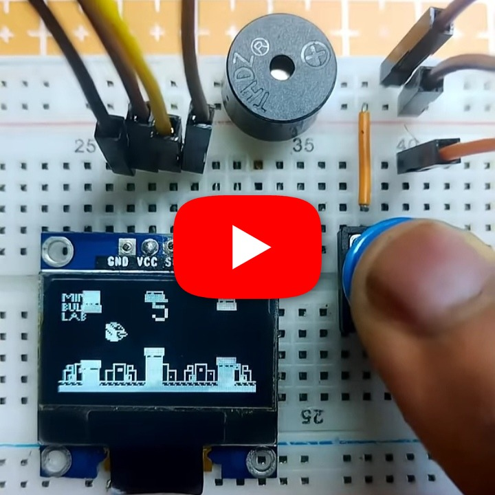

# Flappy Bird on Arduino

A Flappy Bird-style game for Arduino with an SSD1306 128x64 OLED, button control, scrolling backgrounds, animated birds, pipes, scoring, and collision detection.

## Demo

https://youtube.com/shorts/XYnEovBdsMg?feature=share

## Hardware

- Arduino Uno, Nano, or compatible board
- SSD1306 128x64 I2C OLED
- Push button
- Optional passive buzzer

## Wiring

| Component | Pin |
|---|---|
| OLED SDA | board SDA |
| OLED SCL | board SCL |
| Button | 4 |
| Buzzer | 3 |

## How to Play

Press the button to flap upward and release it to fall. Avoid the pipes, score by passing them, and press the button to restart after game over.

## Source

Open [`SourceCode`](./SourceCode), install Adafruit GFX and Adafruit SSD1306, select the board and port, and upload. The default display address is `0x3C`.
