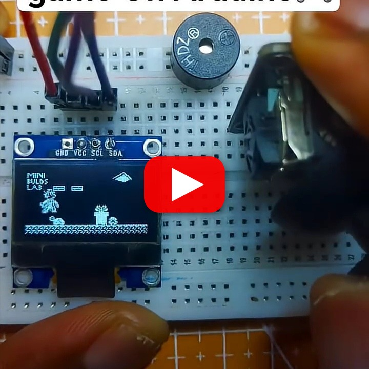

# Mario on Arduino 🎮

A Super Mario-style platformer for Arduino/ESP32 with an SSD1306 OLED, joystick controls, physics, enemies, collectibles, and sound effects.

## Demo

https://youtube.com/shorts/EBJ509lZZzw?si=qdLsbm_wCAou-vTR

## Hardware

- Arduino or ESP32
- Adafruit SSD1306 128x64 OLED
- Analog joystick
- Buzzer

## Wiring

| Component | Pin |
|---|---|
| Joystick X | A0 |
| Joystick Y | A1 |
| OLED SDA | board SDA |
| OLED SCL | board SCL |
| Buzzer signal | 3 |

## Source

Install Adafruit GFX and Adafruit SSD1306, then open [`Source_Code`](./Source_Code), select the board and port, and upload.
