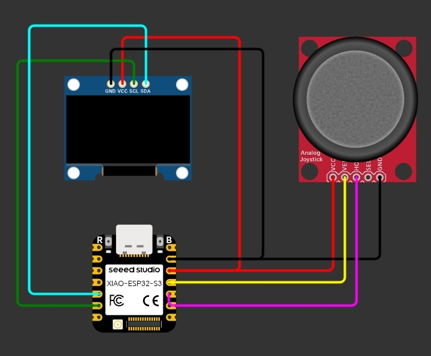

# Pac-Man on Arduino

A classic Pac-Man game for Arduino/ESP32 with a 128x64 SSD1306 OLED, joystick input, maze nodes, pellets, animated sprites, ghosts, and buzzer sounds.

## Demo

https://youtube.com/shorts/aVP9bUrWy6I?si=33jqzH-mrr6xtznP

## Hardware

- Arduino-compatible board or ESP32
- SSD1306 128x64 I2C OLED
- Analog joystick
- Buzzer

## Wiring

| Component | Pin |
|---|---|
| OLED SDA | board SDA |
| OLED SCL | board SCL |
| Joystick X | A0 |
| Joystick Y | A1 |
| Buzzer | 2 |

## Source

Install Adafruit GFX and Adafruit SSD1306 using the Arduino IDE Library Manager. Connect the display and controls, open the sketch in this directory, upload, and start playing.
