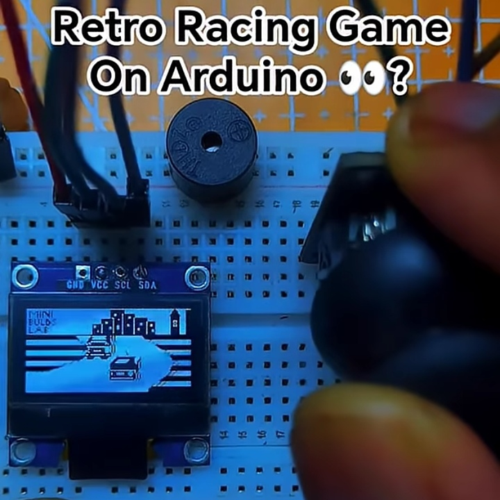

# Pseudo-3D Racing Game on Arduino

A retro-style pseudo-3D racing game for Arduino/ESP32 with perspective road rendering, a player car, an AI opponent, animated sprites, countdown audio, and race results.

## Demo

https://youtu.be/6mhX6DsA06M

## Hardware

- Arduino-compatible board or ESP32
- SSD1306 128x64 I2C OLED
- Analog joystick
- Speaker/buzzer

## Controls

- Up: accelerate
- Down: decelerate
- Left/right: steer
- Center: drive straight

## Wiring

| Component | Pin |
|---|---|
| OLED SDA | board SDA |
| OLED SCL | board SCL |
| Joystick X | A0 |
| Joystick Y | A1 |
| Speaker/Buzzer | 3 |

## Source

Install Adafruit GFX and Adafruit SSD1306, open the source sketch in this directory, select the board and port, and upload.
