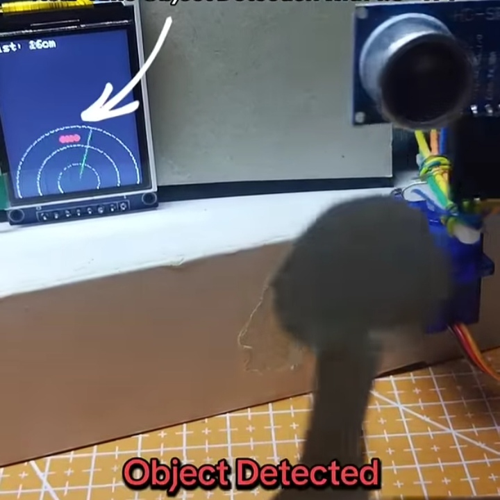
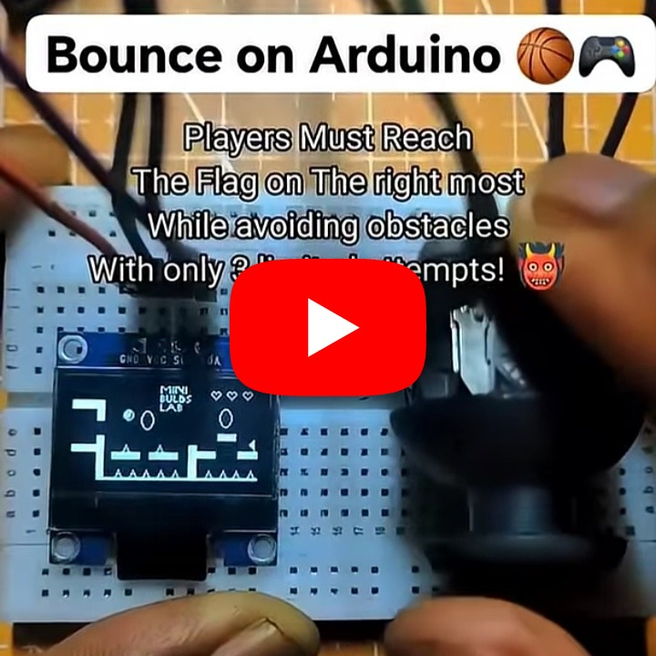
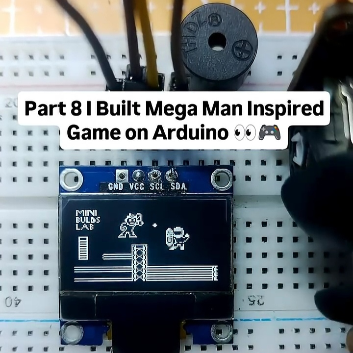
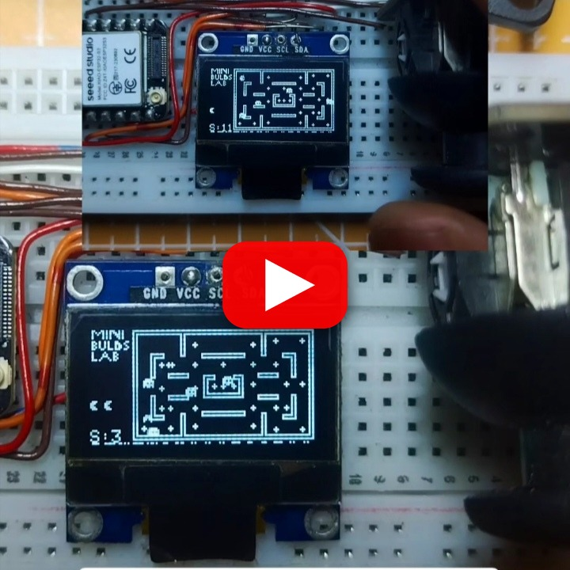

# DIY Arduino & ESP32 Projects

A comprehensive collection of beginner-friendly electronics projects using popular development boards including Arduino and ESP32. This repository showcases interactive games, hardware control projects, and educational demonstrations for embedded systems.

> ▶️ **Click any cover with the YouTube icon to watch the demo video.**

## 📚 Project Collection

<table>
  <tr>
    <td valign="top" width="48%" bgcolor="#f6f8fa">
      
      <h3>📡 Arduino TFT Radar</h3>
      
Ultrasonic radar simulation with an ST7735 TFT display and servo sweep.

      
<strong>Board:</strong> Arduino 
      <strong>Display:</strong> ST7735 TFT 
      <strong>Sensor:</strong> Ultrasonic

      
<a href="./Arduino%20TFT%20Radar">📁 Source</a> · <a href="https://youtube.com/shorts/XTIOUEK2b3Q?feature=share">▶️ Watch on YouTube</a>

    </td>
    <td valign="top" width="48%" bgcolor="#f6f8fa">
      
      <h3>🧱 Block Breaker</h3>
      
A classic block-breaking game implementation on Arduino with paddle controls and collision detection.

      
<strong>Board:</strong> Arduino 
      <strong>Display:</strong> SSD1306 OLED 
      <strong>Controls:</strong> Joystick

      
<a href="./Block-Breaker-on-arduino">📁 Source</a> · <a href="https://youtu.be/GAzgyI9GhFs">▶️ Watch on YouTube</a>

    </td>
  </tr>
  <tr>
    <td valign="top" width="48%" bgcolor="#f6f8fa">
      
      <h3>🏀 Bounce</h3>
      
A bouncing ball physics game for Arduino with interactive paddle controls.

      
<strong>Board:</strong> Arduino 
      <strong>Display:</strong> SSD1306 OLED 
      <strong>Controls:</strong> Joystick Module

      
<a href="./Bounce_on_arduino">📁 Source</a> · <a href="https://youtu.be/t_ZkNgfslVo">▶️ Watch on YouTube</a>

    </td>
    <td valign="top" width="48%" bgcolor="#f6f8fa">
      
      <h3>🦖 Dino Run</h3>
      
Chrome's famous Dinosaur runner game ported to Arduino with obstacle avoidance.

      
<strong>Board:</strong> Arduino / ESP32 
      <strong>Display:</strong> SSD1306 OLED 
      <strong>Controls:</strong> Joystick

      
<a href="./Dino_Run">📁 Source</a> · <a href="https://youtube.com/shorts/9tusvMqC588?si=9XAGFWza56ogSxFT">▶️ Watch on YouTube</a>

    </td>
  </tr>
  <tr>
    <td valign="top" width="48%" bgcolor="#f6f8fa">
      
      <h3>🐦 Flappy Bird</h3>
      
The classic Flappy Bird game built for Arduino with smooth animations and collision detection.

      
<strong>Board:</strong> Arduino 
      <strong>Display:</strong> SSD1306 OLED 
      <strong>Controls:</strong> Button / Input

      
<a href="./FlappyBirdOnArduino">📁 Source</a> · <a href="https://youtube.com/shorts/XYnEovBdsMg?feature=share">▶️ Watch on YouTube</a>

    </td>
    <td valign="top" width="48%" bgcolor="#f6f8fa">
      
      <h3>🍄 Mario</h3>
      
Super Mario-inspired platformer game on Arduino with jumping mechanics and obstacles.

      
<strong>Board:</strong> Arduino / ESP32 
      <strong>Display:</strong> SSD1306 OLED 
      <strong>Controls:</strong> Joystick Module

      
<a href="./Mario%20on%20Arduino">📁 Source</a> · <a href="https://youtube.com/shorts/EBJ509lZZzw?si=qdLsbm_wCAou-vTR">▶️ Watch on YouTube</a>

    </td>
  </tr>
  <tr>
    <td valign="top" width="48%" bgcolor="#f6f8fa">
      
      <h3>🤖 Mega Man On Arduino</h3>
      
Mega Man-inspired action shooter game with sprite animations and enemy AI.

      
<strong>Board:</strong> Arduino / ESP32 
      <strong>Display:</strong> SSD1306 OLED 
      <strong>Controls:</strong> Joystick Module

      
<a href="./Mega%20Man%20On%20Arduino">📁 Source</a> · <a href="https://youtube.com/shorts/n5QhOsj3owc?si=HiZ63yME2TeshqBR">▶️ Watch on YouTube</a>

    </td>
    <td valign="top" width="48%" bgcolor="#f6f8fa">
      
      <h3>👾 Pac-Man</h3>
      
Pac-Man game implementation on Arduino with maze navigation and ghost AI.

      
<strong>Board:</strong> Arduino / ESP32 
      <strong>Display:</strong> SSD1306 OLED 
      <strong>Controls:</strong> Joystick Module

      
<a href="./Pac-Man_on_arduino">📁 Source</a> · <a href="https://youtube.com/shorts/aVP9bUrWy6I?si=33jqzH-mrr6xtznP">▶️ Watch on YouTube</a>

    </td>
  </tr>
  <tr>
    <td valign="top" width="48%" bgcolor="#f6f8fa">
      
      <h3>🏎️ Pseudo-3D Racing Game</h3>
      
A pseudo-3D racing game with perspective rendering and AI opponent competition.

      
<strong>Board:</strong> Arduino 
      <strong>Display:</strong> SSD1306 OLED 
      <strong>Style:</strong> Pseudo-3D Racing

      
<a href="./Pseudo-3D%20Racing%20Game%20on%20Arduino">📁 Source</a> · <a href="https://youtu.be/6mhX6DsA06M">▶️ Watch on YouTube</a>

    </td>
    <td valign="top" width="48%" bgcolor="#f6f8fa">
      
      <h3>🏁 Racing Game on ESP32</h3>
      
A fast top-down racing game built for the ESP32 platform with multiple AI cars.

      
<strong>Board:</strong> ESP32 
      <strong>Display:</strong> SSD1306 OLED 
      <strong>Controls:</strong> Button Directional

      
<a href="./Racing%20Game%20on%20ESP32">📁 Source</a> · <a href="https://youtube.com/shorts/Xz7EnjQXIHw?feature=share">▶️ Watch on YouTube</a>

    </td>
  </tr>
  <tr>
    <td valign="top" width="48%" bgcolor="#f6f8fa">
      
      <h3>🦔 Sonic (v1)</h3>
      
Mini Sonic-style platformer on Arduino featuring sprite animations and ring collection.

      
<strong>Board:</strong> Arduino / ESP32 
      <strong>Display:</strong> SSD1306 OLED 
      <strong>Genre:</strong> Side-Scrolling Platformer

      
<a href="./SonicOnArduino">📁 Source</a> · <a href="https://youtube.com/shorts/8RqrcE4Sohk?feature=share">▶️ Watch on YouTube</a>

    </td>
    <td valign="top" width="48%" bgcolor="#f6f8fa">
      
      <h3>🦔 Sonic (v2)</h3>
      
Updated Sonic port with improved mechanics and enhanced gameplay features.

      
<strong>Board:</strong> Arduino / ESP32 
      <strong>Display:</strong> SSD1306 OLED 
      <strong>Controls:</strong> Joystick

      
<a href="./SonicOnArduinoVersion2">📁 Source</a> · <a href="https://youtube.com/shorts/6b8Iq4P6gBc?feature=share">▶️ Watch on YouTube</a>

    </td>
  </tr>
  <tr>
    <td valign="top" width="48%" bgcolor="#f6f8fa">
      <h3>🐍 Snake Game</h3>
      
Classic Snake game with OLED display support and smooth controls.

      
<strong>Board:</strong> Arduino / ESP32 
      <strong>Display:</strong> SSD1306 OLED 
      <strong>Controls:</strong> Joystick

      
<a href="./Snake-game-with-oled">📁 Source</a> · <a href="https://youtube.com/shorts/REPLACE_WITH_SNAKE_VIDEO_ID">▶️ Watch on YouTube</a>

    </td>
    <td valign="top" width="48%" bgcolor="#f6f8fa">
      <h3>⚽ Pixel Soccer</h3>
      
Soccer simulation game with pixel graphics and arcade-style gameplay.

      
<strong>Board:</strong> Arduino / Microcontroller 
      <strong>Display:</strong> Pixel Screen 
      <strong>Gameplay:</strong> Arcade Soccer

      
<a href="./Pixel-soccer">📁 Source</a> · <a href="https://youtube.com/shorts/REPLACE_WITH_PIXEL_SOCCER_VIDEO_ID">▶️ Watch on YouTube</a>

    </td>
  </tr>
  <tr>
    <td valign="top" width="48%" bgcolor="#f6f8fa">
      <h3>🎾 Tennis Game</h3>
      
Tennis simulation on OLED display with two-player or single-player modes.

      
<strong>Board:</strong> Arduino 
      <strong>Display:</strong> SSD1306 OLED 
      <strong>Gameplay:</strong> Arcade Tennis

      
<a href="./TennisGameOnOLED">📁 Source</a> · <a href="https://youtube.com/shorts/REPLACE_WITH_TENNIS_VIDEO_ID">▶️ Watch on YouTube</a>

    </td>
    <td valign="top" width="48%" bgcolor="#f6f8fa">
      <h3>❌ Tic-Tac-Toe</h3>
      
Interactive Tic-Tac-Toe game on Arduino UNO with TFT display support.

      
<strong>Board:</strong> Arduino UNO 
      <strong>Display:</strong> TFT Display 
      <strong>Mode:</strong> Console / Game Board

      
<a href="./Tic-tac-toe-uno-and-tft">📁 Source</a> · <a href="https://youtube.com/shorts/REPLACE_WITH_TIC_TAC_TOE_VIDEO_ID">▶️ Watch on YouTube</a>

    </td>
  </tr>
  <tr>
    <td valign="top" width="48%" bgcolor="#f6f8fa">
      <h3>🔤 Word Scramble</h3>
      
Word puzzle game built for microcontroller play with letter scrambling.

      
<strong>Board:</strong> Arduino / Embedded Board 
      <strong>Display:</strong> SSD1306 OLED 
      <strong>Type:</strong> Puzzle Game

      
<a href="./WordScramble">📁 Source</a> · <a href="https://youtube.com/shorts/REPLACE_WITH_WORD_SCRAMBLE_VIDEO_ID">▶️ Watch on YouTube</a>

    </td>
    <td valign="top" width="48%" bgcolor="#f6f8fa">
      <h3>🔧 Toggle ON/OFF Motor</h3>
      
Control motor operations with TFT touchscreen toggle button functionality.

      
<strong>Board:</strong> Arduino / TFT-enabled Board 
      <strong>Use Case:</strong> Motor Switching 
      <strong>Interface:</strong> Touchscreen

      
<a href="./Toggle-ON-OFF-Motor">📁 Source</a> · <a href="https://youtube.com/shorts/REPLACE_WITH_TOGGLE_MOTOR_VIDEO_ID">▶️ Watch on YouTube</a>

    </td>
  </tr>
</table>

## 🛠️ Technologies & Components

- **Microcontrollers**: Arduino, Arduino UNO, ESP32
- **Display Options**: SSD1306 OLED displays (128x64), ST7735 TFT displays, Touchscreen TFT
- **Sensors & Modules**: Ultrasonic sensors, servo motors, joysticks, buzzers, buttons
- **Primary Language**: C++
- **IDE**: Arduino IDE compatible sketches

## 🎯 Target Audience

Perfect for beginners learning electronics, microcontrollers, and embedded systems programming. Each project includes practical examples of:
- GPIO control and digital I/O
- I2C and SPI display interfacing
- Sensor integration and data processing
- Game logic and physics implementation
- Hardware-software integration
- Real-time event handling

## 📖 Getting Started

Each project directory contains the necessary code and documentation to get started. Projects are compatible with Arduino IDE for easy deployment. Typical steps:

1. **Navigate to your project folder** from the links above
2. **Check the project's README** for specific hardware requirements and wiring
3. **Install required libraries** using Arduino IDE Library Manager (Adafruit GFX, Adafruit SSD1306, etc.)
4. **Copy the source code** to your Arduino IDE
5. **Configure pin assignments** if needed for your setup
6. **Connect your hardware** according to the project's wiring diagram
7. **Select board and COM port** in Arduino IDE
8. **Upload and test** your project

For detailed instructions, refer to each project's folder.

## ⚡ Features

- ✅ Beginner-friendly, well-commented code examples
- ✅ Multiple game implementations with different genres
- ✅ Hardware control and sensor demonstrations
- ✅ Interactive projects for embedded systems learning
- ✅ OLED and TFT display projects
- ✅ Complete schematics and wiring diagrams
- ✅ Educational value for microcontroller programming
- ✅ YouTube video demos for most projects

## 📋 Project Statistics

| Category | Count |
|----------|-------|
| Game Projects | 16 |
| Hardware Control Projects | 2 |
| Total Projects | 18 |
| OLED Projects | 13 |
| TFT Projects | 3 |
| Arduino Compatible | All |
| ESP32 Compatible | 6+ |

## 🎮 Game Genres Covered

- 🏃 **Endless Runners**: Dino Run
- 🦔 **Platformers**: Sonic (v1 & v2), Mario
- 🎮 **Arcade Classics**: Pac-Man, Snake
- 🎯 **Action Games**: Mega Man, Flappy Bird
- 🏎️ **Racing Games**: Pseudo-3D Racing, Racing Game on ESP32
- 🧱 **Puzzle Games**: Block Breaker, Word Scramble, Tic-Tac-Toe
- 🎾 **Sports Simulations**: Tennis Game, Pixel Soccer
- 🏀 **Physics Games**: Bounce
- 📡 **Utility Projects**: Arduino TFT Radar, Toggle Motor Control

## 💡 Key Learning Topics

- Display interfacing (I2C, SPI)
- Input handling (Analog joystick, buttons)
- Sprite animation and rendering
- Collision detection algorithms
- Game state management
- Audio feedback using buzzers
- Physics simulation
- Memory optimization with PROGMEM
- Sensor data processing

## 🚀 Quick Links

| Resource | Link |
|----------|------|
| Arduino IDE | https://www.arduino.cc/en/software |
| Adafruit GFX Library | https://github.com/adafruit/Adafruit-GFX-Library |
| Adafruit SSD1306 Library | https://github.com/adafruit/Adafruit_SSD1306 |
| Arduino Official Site | https://www.arduino.cc |
| ESP32 Official Site | https://www.espressif.com/en/products/microcontrollers/esp32 |

## 📝 License

Each project in this collection is provided for educational and hobby purposes. Individual projects may have their own licenses specified in their respective directories.

---

## 📊 Repository Info

**Created**: November 5, 2025  
**Last Updated**: September 30, 2026  
**Language**: C++ (Arduino Sketches)  
**Status**: Active Development  
**Maintainer**: MiniBuildsLabZA

## 🤝 Contributing

Contributions are welcome! Whether you want to:
- Add new game projects
- Improve existing code
- Fix bugs or add features
- Create tutorials or documentation
- Share your own embedded systems projects

Please feel free to fork this repository and submit pull requests.

## 📧 Support

For questions, suggestions, or issues:
1. Check the README in each project folder
2. Review the comments in the source code
3. Open an issue on GitHub
4. Feel free to reach out to the maintainers

---

**Happy Building! 🎮✨**
