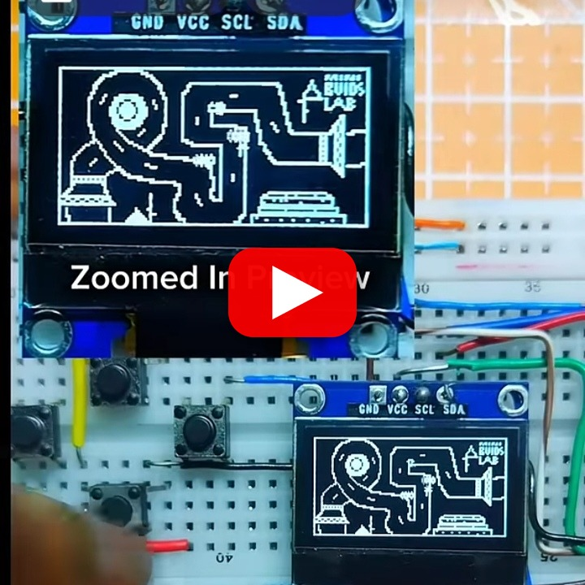

# Racing Game on ESP32

A compact top-down racing game for ESP32 and a 128x64 SSD1306 OLED. Race around a predefined track against AI-controlled cars and view the final finishing position.

## Demo

https://youtube.com/shorts/Xz7EnjQXIHw?feature=share

## Features

- Top-down track rendering
- Multiple AI cars following predefined route points
- Player position tracking
- Start and finish overlays
- Button-based directional controls
- Lightweight ESP32 game loop

## Hardware and wiring

| Component | Connection |
|---|---|
| SSD1306 SDA | GPIO 21 |
| SSD1306 SCL | GPIO 22 |
| OLED power | 3.3V and GND |
| Up button | GPIO 32 |
| Down button | GPIO 33 |
| Left button | GPIO 25 |
| Right button | GPIO 26 |

Wire each button between its GPIO and GND, using the GPIO pull-up configuration.

## Controls

Use the four directional buttons to steer. Press any direction button on the title screen to start the race.

## Installation

Install Adafruit GFX, Adafruit SSD1306, and Wire. Open the source file, select an ESP32 board and serial port, and upload. The OLED address is `0x3C`.

Possible enhancements include lap timing, difficulty settings, collisions, boost pickups, and improved AI.
