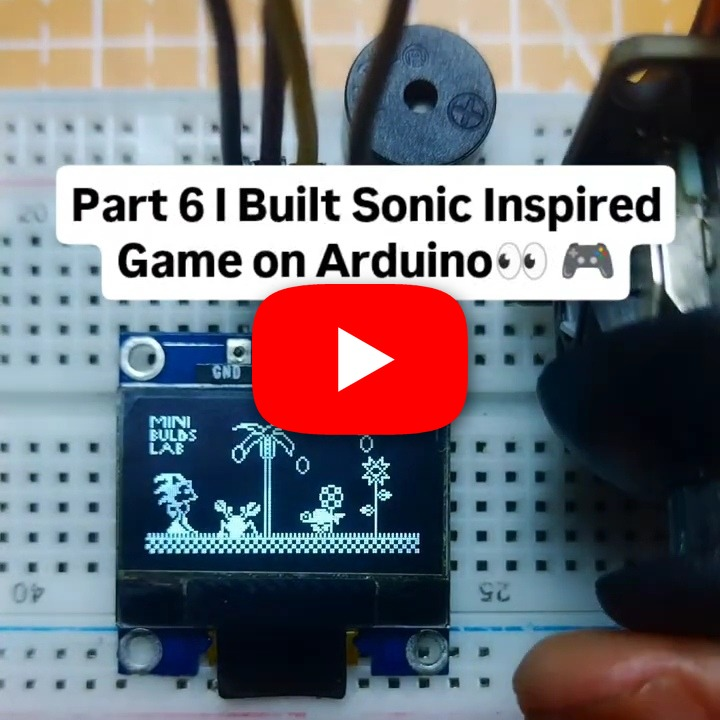

# SonicOnArduino

A Sonic-style side-scrolling game for Arduino/ESP32 using an SSD1306 128x64 OLED. It includes sprite animations, ring collection, enemies, trees, a boss, scoring, and buzzer sounds.

## Demo

https://youtube.com/shorts/8RqrcE4Sohk?feature=share

## Hardware

- Arduino Uno/Nano or ESP32
- SSD1306 128x64 I2C OLED
- Buzzer
- Button
- Optional joystick or potentiometers

## Wiring

| Component | Pin |
|---|---|
| OLED SDA | board SDA |
| OLED SCL | board SCL |
| Buzzer | 2 |
| Joystick X (optional) | A0 |
| Joystick Y (optional) | A1 |

## Source

Install Adafruit GFX and Adafruit SSD1306, inspect [`SourceCode`](./SourceCode), adjust pin definitions if necessary, and compile and upload.
