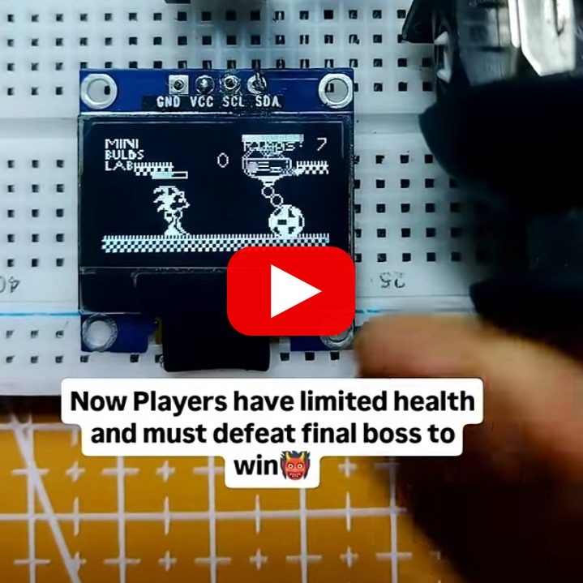

# SonicOnArduino Version 2

An upgraded Sonic-style game for Arduino/ESP32 and an SSD1306 128x64 OLED. Version 2 adds new sprites, boss animations, hitboxes, rings, health, and level elements.

## Hardware

[Sonic v2 Wiring Diagram]

- ESP32 or Arduino
- SSD1306 128x64 I2C OLED
- Passive buzzer
- Momentary button
- Two-axis analog joystick

Typical connections use board I2C pins, buzzer pin 3, button pin 4, and analog inputs A0/A1. Remap these pins when required by your board; ESP32 users should select ADC-capable pins.

## Source

Install Adafruit GFX and Adafruit SSD1306, then open the main sketch in [`Source-code`](./Source-code), select the correct board and port, and upload.
